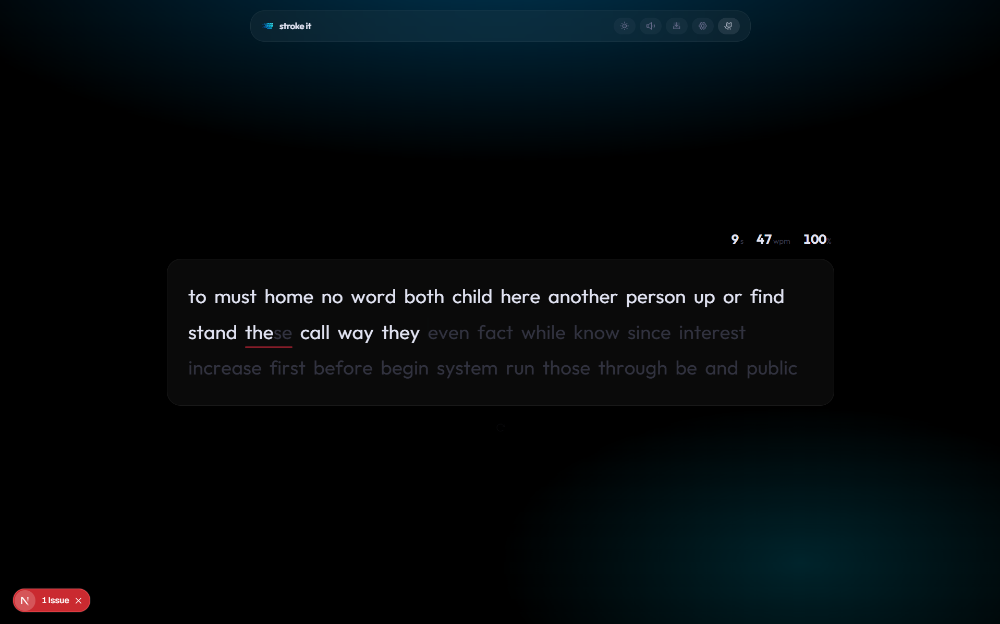

<div align="center">


# Stroke it

**Type with sound. Feel the rhythm.**

Free, full-stack typing test - Keystroke sounds · Error feedback · WPM tracking · Sound packs · PWA

</br>

[](https://strokeit.vercel.app)

</br>



</div>

---

## What is Stroke it?

Stroke it is a typing test built around sound. Every keystroke triggers a real recorded audio sample — choose from 5 sound packs including the original OGG sprite and 4 crisp MP3 alternatives. Miss a key? Get instant feedback from 7 distinct error sounds. No sign-up, no distractions. Just you, the words, and the sound of typing.

It uses **Next.js 16 (App Router)** for the frontend, **Turso (libSQL) + Drizzle ORM** for optional leaderboard storage, and a polished **Tailwind CSS v4** dark interface with subtle accent glow.

---

## Features

- **Rhythm-based typing** — hear every keystroke through real recorded audio (OGG sprite + 4 MP3 packs)
- **7 error sounds** — pick your favourite "fahhhhh", buzz, thud, or spring jump on mistype
- **Sound packs** — 5 keystroke sound sets to switch between in settings
- **Customizable volume** — per-sound-type control with up to 5× gain
- **WPM tracking** — real-time words-per-minute, accuracy, and personal bests
- **Words & quotes modes** — type random words or famous quotes
- **Pure black dark UI** — subtle accent glow, zero clutter
- **PWA installable** — works offline after first visit
- **Keyboard shortcuts** — mute (⌘⇧M), settings (⌘K)
- Zero ads · Zero tracking · Zero sign-up

---

## Tech Stack

### Frontend

| Technology | Version | Purpose |
|---|---|---|
| [Next.js](https://nextjs.org) | `16.1.7` | React framework (App Router) |
| [TypeScript](https://www.typescriptlang.org) | — | Type safety |
| [React](https://react.dev) | `^19.2.4` | UI library |
| [Tailwind CSS](https://tailwindcss.com) | `v4` | Utility-first styling |
| [motion](https://motion.dev) | `^12.38.0` | Animations & transitions |
| [Phosphor Icons](https://phosphoricons.com) | `^2.1.10` | Icon library |
| [Tabler Icons](https://tabler-icons.io) | `^3.41.1` | Icon library |
| [@number-flow/react](https://number-flow.vercel.app) | `^0.6.0` | Animated number transitions |
| [clsx](https://github.com/lukeed/clsx) + [tailwind-merge](https://github.com/dcastil/tailwind-merge) | — | Conditional class merging |

### Backend & Infrastructure

| Technology | Version | Purpose |
|---|---|---|
| [Turso (libSQL)](https://turso.tech) | — | Edge-hosted SQL database |
| [Drizzle ORM](https://orm.drizzle.team) | `^0.45.2` | Type-safe database queries |
| [Serwist](https://serwist.pages.dev) | `^9.5.7` | PWA service worker |
| [Vercel](https://vercel.com) | — | Production deployment |

### Audio

| Technology | Purpose |
|---|---|
| Web Audio API (AudioBuffer + AudioSprite) | Real-time keystroke & error playback |

---

## Getting Started

### Prerequisites

- Node.js `18.x` or higher
- npm

### Installation

```bash
git clone https://github.com/code2ahm/strokeit.git
cd strokeit
npm install
```

### Development

```bash
npm run dev
```

Open [http://localhost:3000](http://localhost:3000).

### Production Build

```bash
npm run build
npm start
```

---

## Deployment

### Vercel (recommended)

```bash
# Install Vercel CLI
npm install -g vercel

# Deploy
vercel
```

Or connect your GitHub repo directly via [vercel.com/import](https://vercel.com/import).

### Other hosts

Any host supporting Next.js (Cloudflare Pages, Netlify, etc.):

```bash
npm run build
# Output in /.next
```

---

## Contributing

Pull requests are welcome. For major changes, open an issue first.

```bash
# Fork and clone
git clone https://github.com/your-username/strokeit.git
cd strokeit

# Create a feature branch
git checkout -b feat/your-feature

# Make changes, then
npm run build

# Push and open a PR
git push origin feat/your-feature
```

---

<div align="center">

Built with [Next.js](https://nextjs.org) · [Turso](https://turso.tech) · [Drizzle](https://orm.drizzle.team) · [Tailwind CSS](https://tailwindcss.com)

**[strokeit.vercel.app](https://strokeit.vercel.app)**

</div>
